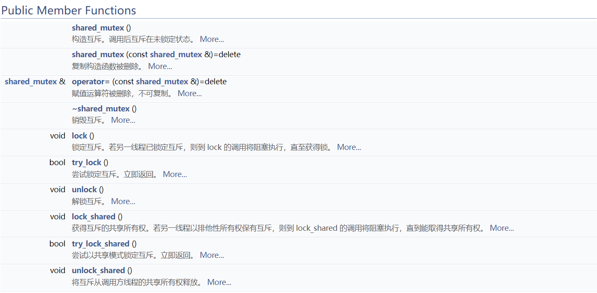
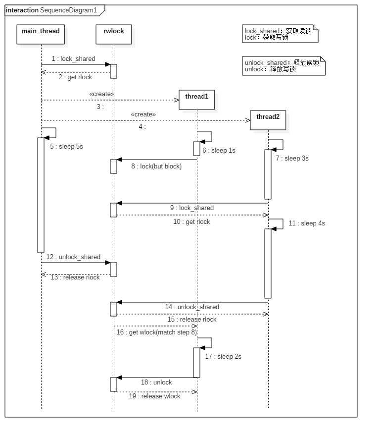

## C++STL shared_mutex实现与分析

### shared_mutex简介

shared_mutex 类是一个同步原语，可用于保护共享数据不被多个线程同时访问。

与便于独占访问的其他互斥类型不同，shared_mutex 拥有二个访问级别：

- 共享 - 多个线程能共享同一互斥的所有权。

- 独占性 - 仅一个线程能占有互斥。

shared_mutex类的公开方法包括：



std::shared_mutex是在C++17标准中引入的，std::shared_mutex的更完整描述可以在[cppreference.com](https://en.cppreference.com/w/cpp/thread/shared_mutex)网页上找到。


### shared_mutex语义

对于非C++标准来说，shared_mutex的更容易理解的名称是**读写锁**（read-write lock）。

相比于**读写锁**，更基础的是**互斥锁**，所以我们先从互斥锁说起（互斥锁在C++标准中的名称是std::mutex）。

**互斥锁**会把试图进入**临界区**的所有其他线程都阻塞住。该临界区通常涉及对由这些线程共享的一个或多个数据的访问或更新。然而有时候我们可以在**读**某个数据与**修改**某个数据之间作区分。这也是使用**读写锁**的场景条件之一。

对于在获取读写锁用于读或获取读写锁用于写之间的区别，规则如下：
- 只要没有线程持有某个给定的读写锁用于写，那么任意数目的线程可以持有该读写锁用于读。
- 仅当没有线程持有某个给定的读写锁用于读或用于写时，才能分配给读写锁用于写。

换一种说法就是，只要没有线程在修改某个给定的数据，那么任意数目的线程都可以拥有该数据的读访问权。仅当没有其他线程在读或修改某个给定的数据时，当前线程才可以修改它。

某些应用中读数据比修改数据频繁，这些应用可以从改用读写锁代替互斥锁中获益。任意给定时刻允许多个读出者存在提供了更高的并发度，同时在某个写入者修改数据期间保护该数据，以免任何其他读出者或写入者的干扰。这也是判断是否应该使用**读写锁**的依据之一。

这种对于某个给定资源的共享访问也称为共享-独占（shared-exclusive）上锁（这就是shared_mutex中shared的由来），其中获取一个读写锁用于读称为**共享锁**（shared lock），对应的就是shared_mutex::lock_shared方法，获取一个读写锁用于写称为**独占锁**（exclusive lock），对应的就是shared_mutex::lock方法。有人可能有疑问，为啥独占锁对应的方法是shared_mutex::lock，而不是shared_mutex::lock_unique之类的呢？其实原因是为了跟std::mutex的lock方法名一致，而这样做的原因是为了让std::lock_guard和std::unique_lock等模板类能复用在shared_mutex上，具体细节这里就不展开了。


### shared_mutex实现

接下来，我们将自己动手实现一个shared_mutex类。
[完整工程代码](https://gitee.com/hexu1985/Reimplement.Of.Cpp.Standard.Library/tree/master/code/concurrency/shared_mutex/recipe-02)

**1. shared_mutex类的数据结构**

shared_mutex包含如下成员变量：

```cpp
class shared_mutex {
private:
    std::mutex              mutex;
    std::condition_variable read;       // wait for read
    std::condition_variable write;      // wait for write
    int                     r_active;   // readers active
    int                     w_active;   // writer active
    int                     r_wait;     // readers waiting
    int                     w_wait;     // writers waiting
// ...
};
```

- 用于序列化成员变量存取的互斥量（mutex）。
- 两个独立的条件变量，一个用于等待读操作（read），一个用于等待写操作（write）。
- 为了能够判断条件变量上是否有等待线程，我们将保存活跃的读线程数（r_active）和一个指示活跃的写线程数（w_active）的标志。
- 我们也保留了等待读操作的线程数（r_wait）和等待写操作的线程数（w_wait）。

这里w_active虽然是int类型，其实是表示一个bool标志，因为只能有一个”活动的写线程“（持有写锁），但考虑到内存对齐，这里使用bool还是int，其实是没差别的。

**2. shared_mutex类的构造与析构**

首先是构造函数：
```cpp
shared_mutex::shared_mutex():
    r_active(0), w_active(0), r_wait(0), w_wait(0)
{
}
```
并没有什么需要特别强调的，mutex、read、write这三个成员变量会调用默认构造函数，shared_mutex对象构造完成后，处于未加锁的状态。
	
然后是析构函数：

```cpp
shared_mutex::~shared_mutex()
{
    assert(r_active == 0);
    assert(w_active == 0);
    assert(r_wait == 0);
    assert(w_wait == 0);
}
```

更是没什么好说的，只是加了一些断言而已。

**3. shared_mutex类的获取/释放共享锁（读锁）的相关方法**

首先是lock_shared方法，为读操作获取共享锁（读锁）。

```cpp
void shared_mutex::lock_shared()
{
    std::unique_lock<std::mutex> lock(mutex);
    if (w_active) {
        r_wait++;
        while (w_active) {
            read.wait(lock);
        }
        r_wait--;
    }
    r_active++;
}
```

- 如果当前没有写线程是活动的，那么我们就登记r_active成员变量，更新活动的读线程数+1，并从lock_shared方法返回，表示获取共享锁成功。
- 如果一个写线程当前是活动的（w_active非0），我们就登记r_wait成员变量，更新等待读线程的数量+1，然后wait在read条件变量上（直到写线程释放了锁，并通过read条件变量唤醒了当前线程）。
- 另外，为了简化实现，这里并没考虑线程wait在read条件变量时，线程被cancel的情况，这种情况下r_wait并不会-1，从而造成数据不一致。对于这种情况的处理，可以参考相关书籍，这里就不在赘述了。

然后是try_lock_shared方法：

```cpp
bool shared_mutex::try_lock_shared()
{
    std::lock_guard<std::mutex> lock(mutex);
    if (w_active) {
        return false;
    } else {
        r_active++;
        return true;
    }
}
```

代码逻辑跟lock_shared很像，除了：

- 当有一个写线程活动时，它将直接返回false，而不是block在read条件变量上。
- 如果获取共享锁（读锁）成功，返回的true。

最后是unlock_shared方法：

```cpp
void shared_mutex::unlock_shared()
{
    std::lock_guard<std::mutex> lock(mutex);
    r_active--;
    if (r_active == 0 && w_wait > 0) {
        write.notify_one();
    }
}
```

该函数实质上是通过减少活跃的读线程数（r_active）颠倒了lock_shared或try_lock_shared的效果。如果不在有活跃的读线程，并且至少有一个线程正在等待写操作，会通知write条件变量来唤醒其中的一个。

**4. shared_mutex类的获取/释放独占锁（写锁）的相关方法**

首先是lock方法，为写操作获取独占锁（写锁）。

```cpp
void shared_mutex::lock()
{
    std::unique_lock<std::mutex> lock(mutex);
    if (w_active || r_active > 0) {
        w_wait++;
        while (w_active || r_active > 0) {
            write.wait(lock);
        }
        w_wait--;
    }
    w_active = 1;
}
```

该函数很像lock_shared，除了在write条件变量上等待的谓词条件。

- 如果当前有任何写线程或读线程是活动的，我们就登记w_wait成员变量，更新等待写线程的数量+1，然后wait在write条件变量上（直到有写线程释放了锁，或者所有的读线程释放了锁，并通过write条件变量唤醒了当前线程）。
- 否则，那么我们就登记w_active成员变量，更新活动的写线程标志为1（true），并从lock方法返回，表示获取独占锁成功。
- 另外，为了简化实现，这里并没考虑线程wait在write条件变量时，线程被cancel的情况，这种情况下w_wait并不会-1，从而造成数据不一致。对于这种情况的处理，可以参考相关书籍，这里就不在赘述了。

然后是try_lock方法：

```cpp
bool shared_mutex::try_lock()
{
    std::lock_guard<std::mutex> lock(mutex);
    if (w_active || r_active > 0) {
        return false;
    } else {
        w_active = 1;
        return true;
    }
}
```

代码逻辑lock很像，除了：

- 如果读写锁当前被使用（或者被一个读线程或者一个写线程），它将直接返回false，而不是block在read条件变量上。
- 如果获取独占锁（写锁）成功，返回的true。

最后是unlock方法：

```cpp
void shared_mutex::unlock()
{
    std::unique_lock<std::mutex> lock(mutex);
    w_active = 0;
    if (r_wait > 0) {
        read.notify_all();
    } else if (w_wait > 0) {
        write.notify_one();
    }
}
```

该函数被一个线程调用来释放写锁。

- 当一个写线程释放读写锁时，它总是可用的；如果有任何线程等待，必须唤醒其中一个。
- 这里的实现时”读优先“的，首先寻找正在等待的读线程。如果有，将广播read条件变量来唤醒它们。
- 如果没有等待的读线程，但是有一个以上的写线程等待，通过通知write条件变量来唤醒其中一个。

至此，shared_mutex类的完整实现就介绍完了。


### shared_mutex使用示例

接下来，我们通过一个shared_mutex类的使用示例，介绍shared_mutex类的共享-独占特性。

首先，我们先给出一个完整的示例代码：

```cpp
#include <iostream>
#include <string>
#include <chrono>
#include <iomanip>
#include <thread>
#include <shared_mutex>
#include "shared_mutex.hpp"

Hx::shared_mutex rwlock;

void thread1();
void thread2();

inline
std::ostream& operator<<(std::ostream &os,
        const std::chrono::time_point<std::chrono::system_clock> &t)
{
    const auto tt (std::chrono::system_clock::to_time_t(t));
    const auto loct (std::localtime(&tt));
    return os << std::put_time(loct, "%c");
}

inline
std::chrono::time_point<std::chrono::system_clock> gf_time()
{
    return std::chrono::system_clock::now();
}

inline
void sleep(int nsecs)
{
    std::this_thread::sleep_for(std::chrono::seconds(nsecs));
}

int main(int argc, char *argv[])
{
    std::thread thr1, thr2;

    rwlock.lock_shared();   /* parent read locks entire file */
    std::cout << gf_time() << ": parent has read lock" << std::endl;

    thr1 = std::thread(&thread1);
    thr2 = std::thread(&thread2);

	/* 4parent */
    sleep(5);
    rwlock.unlock_shared();
    std::cout << gf_time() << ": parent releases read lock" << std::endl;

    thr1.join();
    thr2.join();

    return 0;
}

void thread1()
{
    sleep(1);
    std::cout << gf_time() << ": first child tries to obtain write lock" << std::endl;
    rwlock.lock();  /* this should block */
    std::cout << gf_time() << ": first child obtains write lock" << std::endl;
    sleep(2);
    rwlock.unlock();
    std::cout << gf_time() << ": first child releases write lock" << std::endl;
}

void thread2()
{
    /* 4second child */
    sleep(3);
    std::cout << gf_time() << ": second child tries to obtain read lock" << std::endl;
    rwlock.lock_shared();
    std::cout << gf_time() << ": second child obtains read lock" << std::endl;
    sleep(4);
    rwlock.unlock_shared();
    std::cout << gf_time() << ": second child releases read lock" << std::endl;
}
```

该示例代码中，包含两个读者线程（main和thread2）和一个写者线程（thread1），编译运行我们的程序，我们可以看到程序的输出如下（考虑到cpu调度的情况，每次结果不一定完全一样）：

```
11/27/21 14:00:16: parent has read lock
11/27/21 14:00:17: first child tries to obtain write lock
11/27/21 14:00:19: second child tries to obtain read lock
11/27/21 14:00:19: second child obtains read lock
11/27/21 14:00:21: parent releases read lock
11/27/21 14:00:23: second child releases read lock
11/27/21 14:00:23: first child obtains write lock
11/27/21 14:00:25: first child releases write lock
```

为了更容易的看清楚程序运行的过程，我们给出时序图（考虑到cpu调度的情况，这只是典型时序之一，但不妨碍我们分析读写锁的特性）：



- 1~2：main线程调用lock_shared获取读锁，由于没有其他线程占用读写锁，获取读锁成功。
- 3~5：main线程分别创建两个子线程thread1和thread2，main线程创建子线程成功后，就sleep 5秒。
- 6, 8：thread1线程sleep 1秒后，调用lock获取写锁，但这时候由于main线程持有着读锁，所以thread1线程的lock函数block了，rwlock的w_wait为1。
- 7, 9, 10, 11：thread2线程sleep 3秒后，调用lock获取读锁，这时候由于main线程持有着读锁，所以thread2线程也成功持有了读锁，rwlock的r_active为2，thread2线程紧接着sleep 4秒。
- 12~13：main线程从sleep 5秒后唤醒，调用unlock_shared释放读锁，r_active减1，由于thread2还持有读锁，所以rwlock的r_active为1。
- 14~15：thread2线程从sleep 4秒后唤醒，调用unlock_shared释放读锁，r_active减1，这时r_active变成0，这时会进一步检查是否有写线程等待，发现w_wait为1，这是因为这时thread1线程在step 8阻塞在lock函数上，这时，会通知write条件变量唤醒thread1线程。
- 16~19：thread1线程从write条件变量的wait中返回，然后检查发现没有任何其他线程占用读写锁，于是成功持有了写锁，rwlock的w_active为1。然后thread1线程sleep 2秒，调用unlock释放写锁，这时，unlock函数实现里，首先检查是否有读线程等待，如果没有读线程等待，才会再检查是否有写线程等待，这就是”读者优先“策略的表现之一。

可以看到，我们目前实现的shared_mutex类是”读者优先“策略的。


### shared_mutex写者优先

接下来，我们介绍如何将现有实现的shared_mutex类改写成”写者优先“策略的。
[完整工程代码](https://gitee.com/hexu1985/Reimplement.Of.Cpp.Standard.Library/tree/master/code/concurrency/shared_mutex/recipe-03)

**1. 调整lock_shared逻辑**

为实现写线程优先，当有正在等待的写线程（w_wait>0）时，新的读线程的请求必须被阻塞，而不仅仅是在有活动的写线程时（我们已实现的方式）。

```cpp
void shared_mutex::lock_shared()
{
    std::unique_lock<std::mutex> lock(mutex);
    if (w_active || w_wait > 0) {			// <<<<<< 修改逻辑支持写优先
        r_wait++;
        while (w_active || w_wait > 0) {	// <<<<<< 修改逻辑支持写优先
            read.wait(lock);
        }
        r_wait--;
    }
    r_active++;
}
```

**2. 调整try_lock_shared逻辑**

同样，该函数必须也被修改以实现写线程优先，当有一个写线程活动时，或当一个写线程正在等待时，都会返回false。

```cpp
bool shared_mutex::try_lock_shared()
{
    std::lock_guard<std::mutex> lock(mutex);
    if (w_active || w_wait > 0) {			// <<<<<< 修改逻辑支持写优先
        return false;
    } else {
        r_active++;
        return true;
    }
}
```

**3. 调整unlock逻辑**

要实现写线程优先，只需颠倒两个if测试的先后顺序，即唤醒一个等待的写线程（如果有的话），然后再寻找等待的读线程。

```cpp
void shared_mutex::unlock()
{
    std::unique_lock<std::mutex> lock(mutex);
    w_active = 0;
    if (w_wait > 0) {					// <<<<<< 修改逻辑支持写优先
        write.notify_one();
    } else if (r_wait > 0) {			// <<<<<< 修改逻辑支持写优先
        read.notify_all();
    }
}
```

至此，我们就完成了shared_mutex从读者优先策略，转变成写者优先。

我们可以用写者优先策略的shared_mutex类，再次编译运行之前的示例代码，查看打印输出内容：

```
11/27/21 14:00:46: parent has read lock
11/27/21 14:00:47: first child tries to obtain write lock
11/27/21 14:00:49: second child tries to obtain read lock
11/27/21 14:00:51: parent releases read lock
11/27/21 14:00:51: first child obtains write lock
11/27/21 14:00:53: first child releases write lock
11/27/21 14:00:53: second child obtains read lock
11/27/21 14:00:57: second child releases read lock
```

你有发现什么不同吗？还是老规矩，我们给出时序图：


- 1~2：main线程调用lock_shared获取读锁，由于没有其他线程占用读写锁，获取读锁成功。
- 3~5：main线程分别创建两个子线程thread1和thread2，main线程创建子线程成功后，就sleep 5秒。
- 6, 8：thread1线程sleep 1秒后，调用lock获取写锁，但这时候由于main线程持有着读锁，所以thread1线程的lock函数block了，rwlock的w_wait为1。
- 7, 9：thread2线程sleep 3秒后，调用lock获取读锁，这时候虽然main线程持有着读锁，但thread1线程已经等待着写操作（w_wait为1），所以thread2线程的lock_shared函数也block了，rwlock的r_wait为1。
- 10~11：main线程从sleep 5秒后唤醒，调用unlock_shared释放读锁，r_active减1，这时r_active为0，由于有写线程等待（thread1线程，w_wait为1），所以优先通知write条件变量唤醒thread1线程。
- 12, 13, 14, 15：thread1线程从write条件变量的wait中返回，然后检查发现没有任何其他线程占用读写锁，于是成功持有了写锁（对应step 8），rwlock的w_active为1。然后thread1线程sleep 2秒，调用unlock释放写锁，这时，unlock函数实现里，首先检查是否有写线程等待，如果没有写线程等待，才会再检查是否有读线程等待，这就是”写者优先“策略的表现之一。由于这时候，thread2线程还wait在read条件变量（r_wait为1），所以会通知read条件变量唤醒thread2线程。
- 16~19：thread2线程从read条件变量的wait中返回，然后检查发现没有任何其他线程占用读写锁，于是成功持有了读锁（对应step 9），rwlock的r_active+1。然后thread2线程sleep 2秒，调用unlock_shared释放读锁。

可以看到，我们改写实现的shared_mutex类是”写者优先“策略的。


### 题外话：

**1. 什么是读者优先？**

即使写者发出了请求写的信号，但是只要还有读者在读取内容，就还允许其他读者继续读取内容，直到所有读者结束读取，才真正开始写

- 有读者在读后面来的读者可以直接进入临界区，而已经在等待的写者继续等待直到没有任何一个读者时。
- 读者之间不互斥，写者之间互斥，只能一个写，可以多个读，
- 读者写者之间互斥，有写者写则不能有读者读
- 如果在读访问非常频繁的场合，有可能造成写进程一直无法访问文件的局面

**2. 什么是写者优先？**

如果有写者申请写文件，在申请之前已经开始读取文件的可以继续读取，但是如果再有读者申请读取文件，则不能够读取，只有在所有的写者写完之后才可以读取

- 写者线程的优先级高于读者线程。
- 当有写者到来时应该阻塞读者线程的队列。
- 当有一个写者正在写时或在阻塞队列时应当阻塞读者进程的读操作，直到所有写者进程完成写操作时放开读者进程。
- 当没有写者进程时读者进程应该能够同时读取文件。

**3. C++17标准中的shared_mutex到底是读优先还是写优先？**

据我所知，C++17标准中并没有限定shared_mutex实现策略是读优先还是写优先，而是由编译器厂商决定，即由实现定义的。这一点很像POSIX的读写锁接口（pthread_rwlock_*相关接口）。我随便找了两个版本的g++做了实验，结果表明：

- gcc version 9.3.0的实现中，shared_mutex是读优先的
- gcc version 10.2.0的实现中，shared_mutex是写优先的


### 参考资料：

- UNIX网络编程 卷2：进程间通信 第2版（UNIX Network Programming Volume 2: Interprocess Communications, Second Edition）
- POSIX多线程程序设计（Programming With POSIX Threads）
- 读者写者问题（读者优先 写者优先 读写公平）：<https://www.cnblogs.com/wwqdata/p/12986893.html> 
