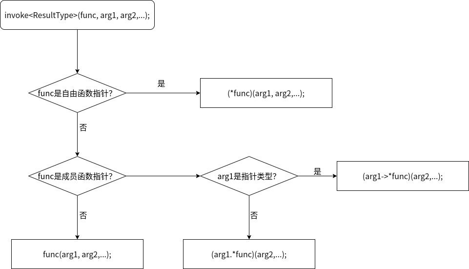

C++STL std::bind实现原理与源码分析
==================================

std::bind采用统一的语法来创建函数对象，以及对于使用该库的类型只有很少的要求。
这种设计使得无需关注如何去写与你的类型一起工作的代码，而只需关注我们最关心的一点，代码如何工作以及它实际上做了什么。
对于Python程序员来说，会发现std::bind类似与functools.partial。

std::bind创建函数对象来绑定到一个函数(普通函数或成员函数)。不需要直接给出函数的所有参数，参数可以稍后给，
这意味着绑定器可以用于创建一个改变了它所绑定到的函数的 arity (参数数量) 的函数对象，或者按照你喜欢的顺序重排参数。

函数 bind 的重载版本的返回类型是未指定的，即不能保证返回的函数对象的特征是怎样的。有时，你需要将对象存于某处，
而不是直接把它传送给另一个函数，这时，你要使用std::function, 另外一篇博客中介绍过。弄明白 bind 函数返回的是什么的关键在于，
理解它发生了什么转换。

### std::bind实现原理

下面，我们引用[Thinking Asynchronously in C++: Bind illustrated](http://blog.think-async.com/2010/04/bind-illustrated.html)，通过具体的例子，介绍std::bind使用和参数转换的原理。

1、bind函数（包装器/适配器）能够将用户提供的需要一个参数的函数调整为不需要参数的函数对象。需要的时候，绑定的值（这个例子中是123）存储在函数对象中，自动地传递给用户指定的函数。
```cpp
f = bind(my_handler, 123)
```


一个匿名类（即这里的binder类)的成员变量捕获了函数指针的值和绑定的参数的值，匿名类重载了`operator()`运算符，从而其对象为仿函数/函数对象。在`operator()`函数体内，使用捕获的函数指针和参数，回调函数指针指向的函数。匿名类只会捕获提前绑定的参数。
当用户调用该函数对象时，实现延迟调用。


2、绑定一个参数也可以将类的成员函数调整为不需要参数的函数对象。正如你所知，非静态的成员函数都有一个隐式的this指针参数。这就意味着在函数指针内部需要绑定一个指向该类的一个对象的指针：
```cpp
f = bind(&session::handler, this)
```


匿名类捕获一个指向session的对象的指针作为其成员变量的值。


3、或者，隐式的this指针可以通过给函数对象传入一个显示的参数：
```cpp
f = bind(&session::handler, _1)
```


4、函数对象通常同时使用提前绑定的参数和调用时提供的参数。这个过程可以通过给成员函数绑定参数来实现：
```cpp
f = bind(&session::handler, this, _1)
```


这里的_1是std::placeholders命名空间里的占位符，在调用函数对象的时候，参数按对应的顺序传递给占位符。


5、当然也可以使用非成员函数：
```cpp
f = bind(my_handler, 123, _1, _2)
```


6、有的时候，函数对象调用时会提供一些不会被目标函数使用到的参数，`bind()`函数会自动的忽略这些多余的参数：
```cpp
f = bind(my_handler, 123, _1)
```


7、多余的参数不需要在函数签名的最后边：
```cpp
f = bind(my_handler, 123, _2)
```


也就是说，提前绑定的参数会使调用时又提供的参数无效而丢弃。

8、`bind() `函数允许改变参数的顺序让目标函数能够适应函数对象的函数签名：
```cpp
f = bind(my_handler, _2, 123, _1)
```


从上边的图中可以看出，`bind() `函数的原理和lambda函数的原理是类似的，都是通过捕获变量来生成一个匿名的类，在类中重载`operator() `，从而其对象是能够调用的函数对象/仿函数。

### std::bind源码分析

接下来我们以《深入应用C++11代码优化与工程级应用》中的bind实现代码，来分析std::bind的源码实现。

首先，给出完整的源码实现：

可以在<https://github.com/hexu1985/Cpp.Standard.Library.Reimplement/tree/master/code/functional/bind/recipe-01/include/bind.hpp>找到.

然后，我们自顶向下（从用户调用的API开始）逐步分析std::bind的实现原理。

1、`bind`函数的定义：

```cpp
template <typename F, typename... P>
inline bind_t<F, P...> bind(F&& f, P&&... par)
{
    return bind_t<F, P...>(std::forward<F>(f), std::forward<P>(par)...);
}
```
`bind`函数返回一个`bind_t<F, P...>`类型的对象，这个`bind_t<F, P...>`类型就对应之前原理分析中的各个binder类，
这里`bind_t`是一个类模板，接下来我们就具体看`bind_t`的定义。

2、`bind_t`类模板的定义：

```cpp
template <typename Fun, typename... Args>
struct bind_t {
    typedef typename std::decay<Fun>::type FunType;
    typedef std::tuple<typename std::decay<Args>::type...> ArgType;
    typedef typename result_traits<FunType>::type ResultType;

public:
    template <typename F, typename... BArgs>
    bind_t(F&& f, BArgs&&... args) : func_(std::forward<F>(f)), args_(std::forward<BArgs>(args)...)
    {
    }

    template <typename... CArgs>
    ResultType operator()(CArgs&&... args)
    {
        return do_call(make_index_sequence<std::tuple_size<ArgType>::value>{},
                std::forward_as_tuple(std::forward<CArgs>(args)...));
    }

    template <typename ArgTuple, std::size_t... Indexes>
    ResultType do_call(index_sequence<Indexes...>&&, ArgTuple&& argtp)
    {
        return invoke<ResultType>(func_, select(std::get<Indexes>(args_), argtp)...);
    }

private:
    FunType func_;
    ArgType args_;
};
```
`bind_t`类主要包含4个部分，两个成员变量：`func_`和`args_`，两个成员函数：构造函数和`operator()`函数。
我们还是以具体例子来介绍这4部分怎么相互作用和相互配合的，以及还需要哪些更底层的工具支持。

3、`bind_t`的构造函数的定义

```cpp
template <typename Fun, typename... Args>
struct bind_t {
...
public:
    template <typename F, typename... BArgs>
    bind_t(F&& f, BArgs&&... args) : func_(std::forward<F>(f)), args_(std::forward<BArgs>(args)...)
    {
    }
...
};
```
`bind_t`的构造函数涉及到一些C++11的技术和库，首先`bind_t`的构造函数是一个可变参数模板函数，
这里的std::forward函数的出现是为了完美转发。

我们以前面的一个图为例：


我们看`f = bind(my_handler, 123, _1, _2);`这句，实际就是调用了`bind_t`的构造函数：
很明显的`my_handler`的地址赋值给了`func_`， 而`(123, _1, _2)`这三个参数则被打包（pack）成一个std::tuple赋值给了`args_`，
所以不考虑std::forward的话， 我们可以大体理解构造函数做的事情就类似于：
```
auto func_ = my_handler;
auto args_ = std::make_tuple(123, _1, _2);
```
至于`_1、_2`这两个占位符对象的类型定义，我们会在后面介绍。

4、`operator()`函数的定以
```cpp
template <typename Fun, typename... Args>
struct bind_t {
...
public:
    template <typename... CArgs>
    ResultType operator()(CArgs&&... args)
    {
        return do_call(make_index_sequence<std::tuple_size<ArgType>::value>{},
                std::forward_as_tuple(std::forward<CArgs>(args)...));
    }
...
};
```
`operator()`函数做了一些参数转化，然后就把调用转发给一个叫做`do_call`的helper函数（也是成员函数），具体的：

首先是通过`make_index_sequence<std::tuple_size<ArgType>::value>{}`创建了传递给`do_call`的第一个实参，
那这条语句的含义是什么呢？简单的说，就是构造了一组0,1,2,3 .... N - 1的一组编译期的可变长度的整数列。
std::make_index_sequence在C++14的时候加入到了标准库，这里的代码实现算是一个简化版的std::make_index_sequence：

```cpp
template <std::size_t... Ints> struct index_sequence {};

template <std::size_t N, std::size_t... Ints>
struct make_index_sequence_impl: make_index_sequence_impl<N - 1, N - 1, Ints...> {};

template <std::size_t... Ints>
struct make_index_sequence_impl<0u, Ints...> { 
    using type = index_sequence<Ints...>; 
};

template <std::size_t N>
using make_index_sequence = typename make_index_sequence_impl<N>::type;
```
根据上面代码，我们可以了解到`make_index_sequence`是一个递归模板，通过模板的递归展开和模板的偏特化结束递归，
最终`make_index_sequence<N>`会创建一个`index_sequence<0,1,2,3,...,N-1>`的类型，
而这个类型就为实现`operator()`函数的参数选择（占位符）提供了支持（这里N为`args_`这个tuple的size）。

然后是把`operator()`函数的实参也打包（pack）成一个tuple（注意这个tuple和args_的大小没有必然关系），作为第二个实参传给`do_call`。还是以刚才的代码例子来分析：
我们之前通过`f = bind(my_handler, 123, _1, _2);`创建了一个匿名的函数对象，然后我们可以通过 `f(ec, length);`来调用这个函数对象；
在这个例子里，当调用`do_call`时，传入的第二个实参类似于`std::make_tuple(ec, length)`。

5、`do_call`函数的定义：
```cpp
template <typename Fun, typename... Args>
struct bind_t {
...
    template <typename ArgTuple, std::size_t... Indexes>
    ResultType do_call(index_sequence<Indexes...>&&, ArgTuple&& argtp)
    {
        return invoke<ResultType>(func_, select(std::get<Indexes>(args_), argtp)...);
    }
...
};
```

我们看看`do_call`都做了什么，`do_call`把`func_`、`args_`和`argtp`结合起来，转发给了`invoke`函数，我们后面再分析`invoke`函数的具体实现，目前我们可以简单理解invoke就是根据func_类型，采取合适的调用语法调用`func_`，
在

```cpp
f = bind(my_handler, 123, _1, _2);
f(ec, length);
```
这个例子里，我们可以简单的理解`invoke<ResultType>(func_, select(std::get<Indexes>(args_), argtp)...);`含义如下：
```cpp
// do_call被调用前就准备好了的参数
auto func_ = my_handler;
auto args_ = std::make_tuple(123, _1, _2);
auto argtp = std::make_tuple(ec, length);
// Indexes = 0, 1, 2
// invoke等价于
func_(select(std::get<Indexes>(args_), argtp)...);
// 等价于my_handler(select(std::get<0>(args_), argtp),
//                  select(std::get<1>(args_), argtp),
//                  select(std::get<2>(args_), argtp));
```
而这里的`select(std::get<Indexes>(args_), argtp)...`就是根据可变参数模板函数的特性，通过`select`函数和Indexes把`args_`和`argtp`展开成了`123, ec, length`，
所以最终实现了，`my_handler(123, ec, length)`的调用。

接下来，我们再来分析select和占位符以及`args_`、`argtp`怎么相互作用，完成参数的选择的。

6、placeholders（占位符）和`select`函数的定义：

```cpp
template <int I>
struct placeholder_t {
};

namespace placeholders {

placeholder_t<1> _1; placeholder_t<2> _2; placeholder_t<3> _3; placeholder_t<4> _4; placeholder_t<5> _5; 
placeholder_t<6> _6; placeholder_t<7> _7;placeholder_t<8> _8; placeholder_t<9> _9; placeholder_t<10> _10;

}   // namespace placeholders

...

template <typename T, typename Tuple>
inline auto select(T&& val, Tuple&) -> T&&
{
    return std::forward<T>(val);
}

template <int I, typename Tuple>
inline auto select(placeholder_t<I>&, Tuple& tp) -> decltype(std::get<I - 1>(tp))
{
    return std::get<I - 1>(tp);
}
```
看到以上代码，我们就很清楚的知道占位符`_1`、`_2`等都是从`placeholder_t`这个模板类实例化出来的具体类的对象，
`placeholder_t`模板类包含一个非类型参数I，用于存储编译期的整数值（占位符索引）。

而`select`函数有两个重载版本，两个版本的`select`函数的主要不同，就在于第一个参数，
以及根据第一个参数类型的不同，采取的不同操作。

如果第一个参数是个`placeholder_t<I>`类型的对象，则`select`就会从第二个参数（一个tuple对象）里取索引为I的元素值返回，
具体的，还是以上面的例子来看，
```cpp
auto args_ = std::make_tuple(123, _1, _2);
auto argtp = std::make_tuple(ec, length);
// select(std::get<1>(args_), argtp); 
// 就等价于
// select(_1, argtp);
// 再等价于
// std::get<0>(argtp);
// 最终等价于
// ec
```

如果第一个参数不是`placeholder_t<I>`类型的对象，那么`select`就直接返回第一个参数作为结果，
具体的，还是以上面的例子来看，
```cpp
auto args_ = std::make_tuple(123, _1, _2);
auto argtp = std::make_tuple(ec, length);
// select(std::get<0>(args_), argtp); 
// 就等价于
// select(123, argtp);
// 最终等价于
// 123
```

至此，我们应该比较清楚，`bind_t`类的`operator()`函数是如何把bind时绑定的参数，和`operator()`函数调用时传入的参数，
有规则的结合在一起，并转发给`func_`的了吧。

7、`invoke`函数的定义：
至此，就差`invoke`函数的介绍了，`invoke`函数在bind库里的作用，主要是为了支持采用统一的语法来创建函数对象。
这一点上和std::function是很类似的，只不过std::bind和std::function的区别是，一个是编译期多态，另一个是运行期多态
（关于std::function的实现分析，可以参考另外一篇博客）。
下面给出`invoke`函数的定义：

```cpp
// The invoker for call a callable
template <typename T>
struct is_pointer_noref
    : std::is_pointer<typename std::remove_reference<T>::type>
{};

template <typename T>
struct is_memfunc_noref
    : std::is_member_function_pointer<typename std::remove_reference<T>::type>
{};

template <typename R, typename F, typename... P>
inline typename std::enable_if<is_pointer_noref<F>::value,
R>::type invoke(F&& f, P&&... par)
{
    return (*std::forward<F>(f))(std::forward<P>(par)...);
}

template <typename R, typename F, typename P1, typename... P>
inline typename std::enable_if<is_memfunc_noref<F>::value && is_pointer_noref<P1>::value,
R>::type invoke(F&& f, P1&& this_ptr, P&&... par)
{
    return (std::forward<P1>(this_ptr)->*std::forward<F>(f))(std::forward<P>(par)...);
}

template <typename R, typename F, typename P1, typename... P>
inline typename std::enable_if<is_memfunc_noref<F>::value && !is_pointer_noref<P1>::value,
R>::type invoke(F&& f, P1&& this_obj, P&&... par)
{
    return (std::forward<P1>(this_obj).*std::forward<F>(f))(std::forward<P>(par)...);
}

template <typename R, typename F, typename... P>
inline typename std::enable_if<!is_pointer_noref<F>::value && !is_memfunc_noref<F>::value,
R>::type invoke(F&& f, P&&... par)
{
    return std::forward<F>(f)(std::forward<P>(par)...);
}
```
`invoke`函数的核心原理就是利用了`type_traits`+`SFINAE`特性，
我们以`invoke<ResultType>(func, arg1, arg2, ...);`为例，给出这段代码的逻辑，图中的判断都是编译期完成的，

也就是因为`invoke`函数，我们可以把自由函数，成员函数+对象指针，成员函数+对象引用，函数对象这4种类型的可调用对象（callable)
的调用语法从某个层面上统一了。

细心的读者可能会发现，这里并没有介绍`bind_t`的ResultType类型的定义，这里ResultType类型的定义就是利用了C++的类型萃取技术，
和`invoke`函数实现里用到的`type_traits`类似，这里就不赘述了。

### 参考资料：

- [Thinking Asynchronously in C++: Bind illustrated](http://blog.think-async.com/2010/04/bind-illustrated.html)
- [C++11 bind函数实现原理图](https://blog.csdn.net/zhouguoqionghai/article/details/45770523)
- 《深入应用C++11代码优化与工程级应用》
