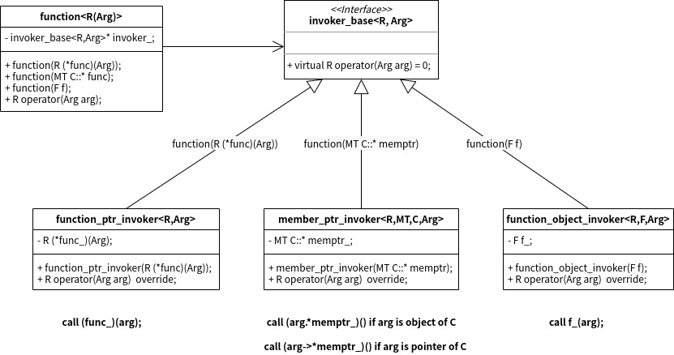

C++STL std::function的使用与实现
================================

学习并掌握一种语言最好的方式, 就是学习这种语言的标准库的使用, 以及学习标准库的实现原理. 本文就是一篇介绍std::function使用和实现的文章.

接下来, 本文将从以下几方面介绍std::funciton

- std::function简介
    + std::function定义
    + std::function如何改进你的程序?
- std::function的用法
    + std::function的声名方式
    + std::function的使用方式
    + std::function作为回调的基础
    + std::function对类成员函数的支持
- std::function的实现
    + std::function的简化实现
    + std::function的完整实现
    + std::function代价的考虑

### std::function简介

#### std::function定义

类模板 std::function 是通用多态函数封装器。 std::function 的实例能存储、复制及调用任何可调用 (Callable) 目标——函数、 lambda 表达式、 bind 表达式或其他函数对象，还有指向成员函数指针和指向数据成员指针。

存储的可调用对象被称为 std::function 的目标。若 std::function 不含目标，则称它为空。调用空 std::function 的目标导致抛出 std::bad_function_call 异常。

std::function 满足可复制构造 (CopyConstructible) 和可复制赋值 (CopyAssignable) 。

以上引自: <https://zh.cppreference.com/w/cpp/utility/functional/function>


#### std::function如何改进你的程序?

在进行回调的设计中，常常需要保存函数和函数对象，而且某些函数或类也是通过函数指针或函数对象来配制其客户化功能。通常，函数指针用于实现回调及延时函数。
但是，仅仅使用函数指针会有很多限制，更好的方法是采用泛型机制来定义要被保存的函数的署名特征，而让调用者来决定提供哪一种的类函数实体(函数指针或函数对象)。
这样就可以使用任何行为类似于函数的东西，例如使用std::bind和lambda表达式或其他函数对象。这意味着可以给这些被保存的函数增加状态(因为函数对象是一种类)。
这种泛化由std::function 提供。用于保存并然后调用函数或函数对象。

也就是说std::function实现了一套类型消除机制，可以统一处理不同的函数对象类型。
以前我们使用函数指针来完成这些；现在我们可以使用更安全的std::function来完成这些任务。


### std::function的用法

#### std::function的声名方式

一个 function 的声明包括该 function 所兼容的函数或函数对象的签名以及返回类型。结果以及参数的类型以单个参数的方式全部提供给模板。
例如，声明一个 function ，它返回 bool 并接受一个类型 int 的参数，如下：

```cpp
std::function<bool (int)> f;
```

可以在括号中给出参数列表，以逗号分隔，就象普通的函数声明一样。所以，声明一个没有返回值(void)并带有类型分别为 int 和 double 的两个参数的函数，就象这样：

```cpp
std::function<void (int,double)> f;
```

#### std::function的使用方式

理解被存函数的最佳方法是把它想象为一个普通的函数对象，该函数对象用于封装另一个函数(或函数对象)。
这个被存的函数的最大用途是它可以被多次调用，而无须在创建 function 时立即使用。
这里有一个完整的程序，程序声明了一个 std::function ，它可以保存返回 bool (或某个可以隐式转换为 bool 的类型)并接受两个参数的类函数实体，
第一个参数可以转换为 int, 第二个参数可以转换为 double.

```cpp
#include <functional>

bool some_func(int i,double d) {
    return i>d;
}

int main() {
    std::function<bool (int,double)> f;
    f = &some_func;
    f(10,1.1);
}
```

当 function f 首次创建时，它不保存任何函数。它是空的，可以在一个布尔上下文中进行测试。
如果你试图调用一个没有保存任何函数或函数对象的 function ，它将抛出一个类 bad_function_call 的异常。
为了避免这个问题，我们用普通的赋值语法把一个指向 some_func的指针赋值给 f 。这导致 f 保存了到 some_func 的指针。
最后，我们用参数 10 (一个 int) 和 1.1 (一个 double)来调用 f (用函数调用操作符)。
要调用一个 function, 你必须提供被存函数或函数对象所期望的准确数量的参数。

#### std::function作为回调的基础

我们先来看看在没有 std::function 以前我们如何实现一个简单的回调，然后再把代码改为使用 function, 并看看会带来什么优势。
我们从一个支持某种简单的回调形式的类开始，它可以向任何对新值关注的对象报告值的改变。这里的回调是一种传统的 C 风格回调，即使用普通函数。
这种回调用可用于象 GUI 控制这样的场合，它可以通知观察者用户改变了它的值，而不需要对监听该信息的客户有任何特殊的知识。

```cpp
#include <iostream>
#include <vector>

void print_new_value(int i) {
  std::cout << 
    "The value has been updated and is now " << i << '\n';
}

void interested_in_the_change(int i) {
  std::cout << "Ah, the value has changed.\n";
}

class notifier {
  typedef void (*function_type)(int);
  std::vector<function_type> vec_;
  int value_;
public:
  void add_observer(function_type t) {
    vec_.push_back(t);
  }

  void change_value(int i) {
    value_=i;
    for (std::size_t i=0;i<vec_.size();++i) {
      (*vec_[i])(value_);
    }
  }
};

int main() {
  notifier n;
  n.add_observer(&print_new_value);
  n.add_observer(&interested_in_the_change);

  n.change_value(42);
}
```

这里的两个函数，print_new_value 和 interested_in_the_change, 它们的函数签名都兼容于 notifier 类的要求。
这些函数指针被保存在一个 vector 内，并且无论何时它的值被改变，这些函数都会在一个循环里被调用。调用这些函数的一种语法是：

```cpp
(*vec_[i])(value_);
```

值(value_)被传递给解引用的函数指针(即 vec_[i] 所返回的)。另一种写法也是有效的，即这样：

```cpp
vec_[i](value_);
```

这种写法看起来更好看些，但更为重要的是，它还可以允许你把函数指针更换为 std::function而没有改变调用的语法。
现在，工作还是正常的，但是，唉，函数对象不能用于这个 notifier 类。
事实上，除了函数指针以外，别的任何东西都不能用，这的确是一种局限。但是，如果我们使用std::function，它就可以工作。
重写这个 notifier 类非常容易。

```cpp
class notifier {
  typedef std::function<void(int)> function_type;
  std::vector<function_type> vec_;
  int value_;
public:
  template <typename T> void add_observer(T t) {
    vec_.push_back(function_type(t));
  }

  void change_value(int i) {
    value_=i;
    for (std::size_t i=0;i<vec_.size();++i) {
      vec_[i](value_);
    }
  }
};
```

首先要做的事是，把 typedef 改为代表 std::function 而不是函数指针。之前，我们定义的是一个函数指针；
现在，我们使用泛型方法，很快就会看到它的用途。接着，我们把成员函数 add_observer 的签名改为泛化的参数类型。
我们也可以把它改为接受一个 std::function，但那样会要求该类的用户必须也知道 function 的使用方法，
而不是仅仅知道这个观察者类型的要求就行了。应该注意到 add_observer 的这种变化并不应该是转向 function 的结果；
无论如何代码应该可以继续工作。我们把它改为泛型的；现在，不管是函数指针、函数对象，还是std::function 实例都可以被传递给 add_observer, 
而无须对已有用户代码进行任何改动。 把元素加入到 vector 的代码有一些修改，现在需要创建一个 std::function<void(int)> 实例。
最后，我们把调用这些函数的语法改为可以使用函数、函数对象以及 std::function 实例。
这种对不同类型的类似函数的"东西"的扩展支持可以立即用于带状态的函数对象，它们可以实现一些用函数很难做到的事情。

```cpp
class knows_the_previous_value {
  int last_value_;
public:
  void operator()(int i) {
    static bool first_time=true;
    if (first_time) {
      last_value_=i;
      std::cout << 
        "This is the first change of value, \
so I don't know the previous one.\n";
      first_time=false;
      return;
    }
    std::cout << "Previous value was " << last_value_ << '\n';
    last_value_=i;
  }
};
```

这个函数对象保存以前的值，并在值被改变时把旧值输出到 std::cout 。注意，当它第一次被调用时，它并不知道旧值。
这个函数对象在函数中使用一个静态 bool 变量来检查这一点，该变量被初始化为 true. 
由于函数中的静态变量是在函数第一次被调用时进行初始化的，所以它仅在第一次调用时被设为 true 。
虽然也可以在普通函数中使用静态变量来提供状态，但是我们必须知道那样不太好，而且很难做到多线程安全。
因此，带状态的函数对象总是优于带静态变量的普通函数。notifier 类并不关心这是不是函数对象，只要符合要求就可以接受。
以下更新的例子示范了它如何使用。

```cpp
int main() {
  notifier n;
  n.add_observer(&print_new_value);
  n.add_observer(&interested_in_the_change);
  n.add_observer(knows_the_previous_value());

  n.change_value(42);
  std::cout << '\n';
  n.change_value(30);
}
```

关键一点要注意的是，我们新增的一个观察者不是函数指针，而是一 knows_the_previous_value 函数对象的实例。运行这段程序的输出如下：

```
The value has been updated and is now 42
Ah, the value has changed.
This is the first change of value, so I don't know the previous one.

The value has been updated and is now 30
Ah, the value has changed.
Previous value was 42
```

在这里最大的优点不是放宽了对函数的要求(或者说，增加了对函数对象的支持)，而是我们可以使用带状态的对象，这是非常需要的。
我们对 notifier 类所做的修改非常简单，而且用户代码不受影响。如上所示，把 std::function 引入一个已有的设计中是非常容易的。
修改成std::function的完整示例代码如下:

```cpp
#include <iostream>
#include <vector>
#include <functional>

void print_new_value(int i) {
  std::cout << 
    "The value has been updated and is now " << i << '\n';
}

void interested_in_the_change(int i) {
  std::cout << "Ah, the value has changed.\n";
}

class notifier {
  typedef std::function<void(int)> function_type;
  std::vector<function_type> vec_;
  int value_;
public:
  template <typename T> void add_observer(T t) {
    vec_.push_back(function_type(t));
  }

  void change_value(int i) {
    value_=i;
    for (std::size_t i=0;i<vec_.size();++i) {
      vec_[i](value_);
    }
  }
};

class knows_the_previous_value {
  int last_value_;
public:
  void operator()(int i) {
    static bool first_time=true;
    if (first_time) {
      last_value_=i;
      std::cout << 
        "This is the first change of value, \
so I don't know the previous one.\n";
      first_time=false;
      return;
    }
    std::cout << "Previous value was " << last_value_ << '\n';
    last_value_=i;
  }
};

int main() {
  notifier n;
  n.add_observer(&print_new_value);
  n.add_observer(&interested_in_the_change);
  n.add_observer(knows_the_previous_value());

  n.change_value(42);
  std::cout << '\n';
  n.change_value(30);
}

```

#### std::function对类成员函数的支持

std::function 不支持参数绑定，这在每次调用一个 function 就要调用同一个类实例的成员函数时是需要的。
幸运的是，如果这个类实例被传递给 function 的话，我们就可以直接调用它的成员函数。这个 function 的签名必须包含类的类型以及成员函数的签名。
换言之，显式传入的类实例要作为隐式的第一个参数，this。这样就得到了一个在给出的对象上调用成员函数的函数对象。
看一下以下这个类：

```cpp
class some_class {
public:
    void do_stuff(int i) const {
        std::cout << "OK. Stuff is done. " << i << '\n';
    }
};
```

成员函数 do_stuff 要从一个 std::function 实例里被调用。要做到这一点，我们需要 function 接受一个 some_class 实例，签名的其它部分为一个 void 返回以及一个 int 参数。
对于如何把 some_class 实例传给 function，我们有三种选择：传值，传引用，或者传址。如何要传值，代码就应该这样写(很少会有理由来以传值的方式传递对象参数。)

```cpp
std::function<void(some_class,int)> f;
```

注意，返回类型仍旧在最开始，后跟成员函数所在的类，最后是成员函数的参数类型。它就象传递一个 this 给一个函数，该函数暗地里用类实例调用一个非成员函数。
要把函数 f 配置为成员函数 do_stuff, 然后调用它，我们这样写：

```cpp
f = &some_class::do_stuff;
f(some_class(),2);
```

如果要传引用，我们要改一下函数的签名，并传递一个 some_class 实例。

```cpp
std::function<void(some_class&,int)> f;
f = &some_class::do_stuff;
some_class s;
f(s,1);
```

最后，如果要传 some_class 的指针，我们就要这样写：

```cpp
std::function<void(some_class*,int)> f;
f = &some_class::do_stuff;
some_class s;
f(&s,3);
```

好了，所有这些传递"虚拟 this"实例的方法都已经在库中提供。当然，这种技术也是有限制的：
你必须显式地传递类实例；而理想上，你更愿意这个实例被绑定在函数中(Python中就是这么做的)。
乍一看，这似乎是 std::function 的缺点，但有别的库可以支持参数的绑定，如 std::bind 和 lambda. 

### std::function的实现

#### std::function的简化实现

为了达到深入浅出的效果, 我们先介绍一种简化的实现: 只支持一个参数的std::function, 即std::function<R (Arg)>这种形式的代码.
那么, 我们看看std::function如何保存并调用一个函数指针、 一个成员函数指针和一个函数对象这三种情形。

我们将要采用的方法是，创建一个泛型基类，它声明了一个虚拟的调用操作符函数；然后，从这个基类派生三个类，分别支持三种不同形式的函数调用。
这些类负责所有的工作，而另一个类，function, 依据其构造函数的参数来决定实例化哪一个具体类。以下是调用器的基类，invoker_base.

```cpp
template <typename R, typename Arg> 
class invoker_base {
public:
    virtual R operator()(Arg arg)=0;
    virtual ~invoker_base() {}
};
```

接着，我们开始定义 function_ptr_invoker, 它是一个具体调用器，公有派生自 invoker_base. 它的目的是调用普通函数。
这个类也接受两个类型，即返回类型和参数类型，它们被用于构造函数，构造函数接受一个函数指针作为参数。

```cpp
template <typename R, typename Arg> 
class function_ptr_invoker : public invoker_base<R,Arg> {
    R (*func_)(Arg);

public:
    function_ptr_invoker(R (*func)(Arg)):func_(func) {}

    R operator()(Arg arg) {
        return (func_)(arg);
    }
};
```

这个类模板可用于调用任意一个接受一个参数的普通函数。调用操作符简单地以给定的参数调用
保存在 func_ 中的函数。请注意(的确有些奇怪)声明一个保存函数指针的变量的那行代码。

```cpp
R (*func_)(Arg);
```

然后, 我们需要一个兼容函数对象的版本。这是所有实现中最容易的一个，至少在我们的方法中是这样。
通过使用单个模板参数，我们只表明类型 F 必须是一个真正的函数对象，因为我们想要调用它。

```cpp
template <typename R, typename F, typename Arg> 
class function_object_invoker : public invoker_base<R,Arg> {
    F f_;
public:
    function_object_invoker(F f):f_(f) {}

    R operator()(Arg arg) {
        return f_(arg);
    }
};
```

最后, 我们实现一个可以处理成员函数调用的类模板。

```cpp
template <typename R, typename MT, typename C, typename Arg> 
class member_ptr_invoker : public invoker_base<R,Arg> {
    MT C::* memptr_;

public:
    member_ptr_invoker(MT C::* memptr): memptr_(memptr) {}

    R operator()(Arg arg) {
        return detail::invoke_memptr<R>(memptr_, arg);
    }
};
```

这块代码相对复杂些, 因为在函数调用时, 需要显式传入的类实例要作为隐式的第一个参数，this。
而传入类实例的方式有三种: 传值，传引用，或者传址. 而这三种方式造成调用类成员函数的语法形式并不统一.
其中, 传值，传引用的方式, 调用类成员函数的语法形式如下:

```cpp
return (arg.*memptr_)();
```

另外, 传址(类对象的指针)的方式, 调用类成员函数的语法形式如下:

```cpp
return (arg->*memptr_)();
或者
return ((*arg).(memptr_))();
```

所以, 这里引入了一个helper函数detail::invoke_memptr进行按类型分发, 利用的是C++的SFINAE规则, 以及<type_traits>库
invoker_memptr的具体实现如下,

```cpp
namespace detail {

template <typename R, typename MT, typename C, typename Arg>
R invoke_memptr_helper(std::true_type /*is_object*/, MT C::* memptr, Arg&& arg)
{
    return (arg.*memptr)();
}

template <typename R, typename MT, typename C, typename Arg>
R invoke_memptr_helper(std::false_type /*is_object*/, MT C::* memptr, Arg&& arg)
{
    return (arg->*memptr)();
}

template <typename R, typename MT, typename C, typename Arg>
R invoke_memptr(MT C::* memptr, Arg&& arg)
{
    typedef typename std::is_base_of<C, typename std::decay<Arg>::type>::type is_object_type;
    return invoke_memptr_helper<R>(is_object_type{}, memptr, arg);
}
}   // namespace detail
```

简单的解释就是, 通过判断Arg的类型是不是C的子类, 来区分arg是类的对象, 还是指针. invoke_memptr函数如果基于C++17的constexpr-if语法来实现,
则可以一目了然的看出类型分发的逻辑.

```cpp
template <typename R, typename MT, typename C, typename Arg>
R invoke_memptr(MT C::* memptr, Arg&& arg)
{
    if constexpr (std::is_base_of_v<C, std::decay_t<Arg>>) {    // object
        return (arg.*memptr)();
    } else {
        return (arg->*memptr)();
    }
}
```

接下来, 就剩下std::function类的实现了.

```cpp
template <typename>
class function {
};

template <typename R, typename Arg> 
class function<R(Arg)> {
    invoker_base<R,Arg>* invoker_;
public:
    function(R (*func)(Arg)) : 
        invoker_(new function_ptr_invoker<R,Arg>(func)) {}

    template <typename MT, typename C> function(MT C::* memptr) : 
        invoker_(new member_ptr_invoker<R,MT,C,Arg>(memptr)) {}

    template <typename F> function(F f) : 
        invoker_(new function_object_invoker<R,F,Arg>(f)) {}

    R operator()(Arg arg) {
        return (*invoker_)(arg);
    }

    ~function() {
        delete invoker_;
    }
};

```

现在看std::function的实现, 就显得自然许多. 结合了策略模式, 通过构造函数的重载, 区分了普通函数指针, 类的成员函数指针和函数对象,
分别构造了invoker_base的不同子类对象, 并通过基类的指针持有, 再在operator()时, 通过虚函数的多态性, 完成函数调用的分发.
下面的类图(并不是标准的UML)可以比较直观了描述std::function的实现逻辑:



完整function.hpp可以在<https://github.com/hexu1985/Cpp.Standard.Library.Reimplement/tree/master/code/functional/function1/recipe-03/include>找到.


#### std::function的完整实现

在std::function的简化实现里, 我们只支持了一个参数的情况, 而真正的std::function是支持任意个参数的(理论上), 除此之外, 
由于std::function的实现中使用了new和delete, 所以还要实现自己复制构造函数, 赋值操作符, 当然还要支持move语义.
而以上这些支持, 其实是属于C++比较通用的技术, 所以这里就不展开介绍了, 这里只是把比较重要技术原理列举出来:

- std::function对支持任意个参数的支持, 需要用到C++的可变模板参数的技术, 即把template <typename Arg>变成template <typename... Args>的形式
- 复制构造函数, 赋值操作符涉及到要复制正确的子类的对象, 这需要用的原型模式(Prototype Pattern)

完整function.hpp可以在<https://github.com/hexu1985/Cpp.Standard.Library.Reimplement/tree/master/code/functional/function/recipe-02/include>找到.


#### std::function代价的考虑

有一句谚语说，世界上没有免费的午餐，对于 std::function 来说也是如此。与使用函数指针相比，使用 std::function 也有一些缺点，特别是对象大小的增加。
显然，一个函数指针只占用一个函数指针的空间大小(这当然了！)，而一个 std::function 实例占的空间有三倍大。
如果需要大量的回调函数，这可能会成为一个问题。函数指针在调用时的效率也稍高一些，因为函数指针是被直接调用的，
而 std::function 可能需要使用两次函数指针的调用。最后，可能在某些需要与 C 库保持后向兼容的情形下，只能使用函数指针。

#### 参考资料:

"Beyond the C++ Standard Library: An Introduction to Boost" -- Library 11. Function

